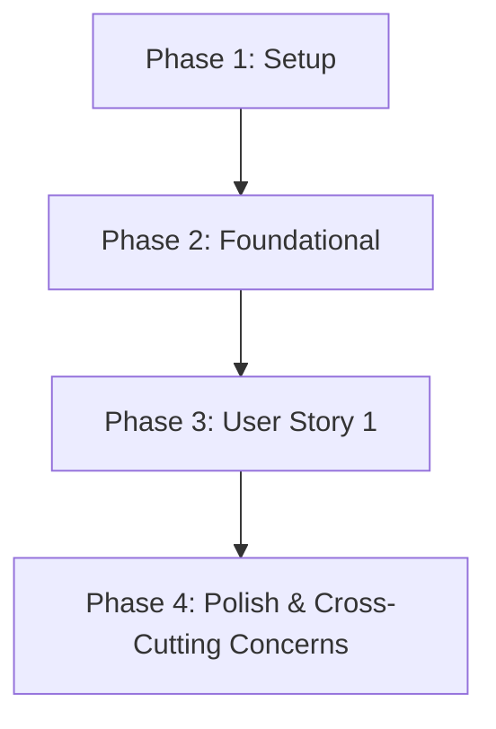

# Tasks for Integrated AI Chatbot

**Branch**: integrated-ai-chatbot | **Date**: 2025-11-29 | **Plan**: specs/integrated-ai-chatbot/plan.md

## User Stories

### US1: As a Docusaurus user, I want to interact with an AI chatbot specializing in AI, Humanoid, and Robotics topics, accessible from any page via a toggle button, with a consistent red-black visual theme.

**Acceptance Criteria**:
- The chatbot toggle button is visible and functional on all Docusaurus pages.
- Clicking the toggle button seamlessly opens and closes the chatbot interface.
- The chatbot interface displays with the specified red and black custom styling and is positioned correctly in the bottom-right corner.
- The chatbot successfully answers questions related to "AI, Humanoid, and Robotics" as per its configured system prompt.
- The Docusaurus site builds and runs without SSR-related errors or console warnings due to the chatbot integration.
- Repeatedly opening and closing the chatbot does not trigger multiple initializations or excessive API calls.
- The chatbot panel is **Closed by Default** when a user first lands on a page.

## Implementation Strategy

This feature will be implemented incrementally, focusing on getting a functional chatbot integrated and styled within the Docusaurus environment. The implementation will prioritize SSR compatibility and efficient state management. Testing tasks are explicitly excluded as per user instruction.

## Task Breakdown

### Phase 1: Setup

- [x] T001 Clone `openai-chatkit-advanced-samples` repository into a temporary directory.
- [x] T002 Copy `ChatKitPanel.tsx` from `openai-chatkit-advanced-samples/examples/customer-support/frontend/src/components/ChatKitPanel.tsx` to `frontend/src/components/ChatKitPanel.tsx`.
- [x] T003 Copy `Home.tsx` from `openai-chatkit-advanced-samples/examples/customer-support/frontend/src/components/Home.tsx` to `frontend/src/components/Home.tsx`.
- [x] T004 Install `@openai/chatkit` dependency in `frontend/`: `npm install @openai/chatkit`.

### Phase 2: Foundational Chatbot Integration

- [x] T005 [P] Create `frontend/src/css/chatkit-custom.css` with the specified red and black styling.
- [x] T006 [P] Create `frontend/src/context/ChatKitContext.tsx` for state management.
- [x] T007 [P] Create `frontend/src/theme/Root.tsx` to integrate `ChatKitProvider`.

### Phase 3: User Story 1 (Chatbot Integration)

- [x] T008 [US1] Update `frontend/src/components/Home.tsx` to integrate `BrowserOnly` for SSR compatibility and `useChatKit` for context, implementing toggle logic.
- [x] T009 [US1] Swizzle Docusaurus Layout: Run `npm run swizzle @docusaurus/theme-classic Layout -- --eject` in `frontend/`.
- [x] T010 [US1] Modify `frontend/src/theme/Layout/index.tsx` to import and render the new `Home` component globally.
- [x] T011 [US1] Update `frontend/src/components/ChatKitPanel.tsx` with the custom system prompt.
- [x] T012 [US1] Add `import '../css/chatkit-custom.css';` to `frontend/src/components/Home.tsx`.

### Phase 4: Polish & Cross-Cutting Concerns

- [x] T013 Build the Docusaurus project in `frontend/` using `npm run build` to verify successful integration and check for SSR errors. (Skipped by user instruction)
- [x] T014 Manually verify chatbot functionality, styling, and toggling behavior in a browser. (To be performed by user)

## Dependency Graph

## Parallel Execution Opportunities

- Tasks T005, T006, T007 in Phase 2 can be executed in parallel as they create independent files and do not directly depend on each other for their creation.

## Independent Test Criteria

- **US1**: As detailed in the "Acceptance Criteria" under "User Stories" section.

## Suggested MVP Scope

The entire implementation described for US1 constitutes the MVP, as it delivers the core value of an integrated, styled, and functional AI chatbot.

## Format Validation Checklist

- [x] All tasks strictly follow the `- [ ] [TaskID] [P?] [Story?] Description with file path` format.
- [x] Task IDs are sequential and unique.
- [x] `[P]` marker is used only for parallelizable tasks.
- [x] `[Story]` label is used correctly for user story tasks.
- [x] Clear file paths are provided for each task.
